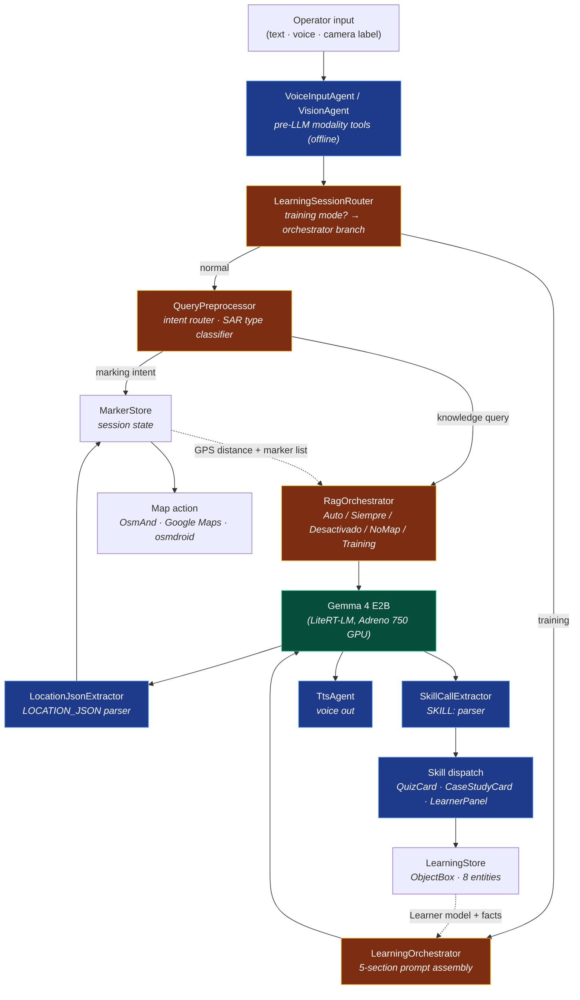

# Kognis Lite — Offline Humanitarian Field Assistant

> 📱 **APK release:** **[v1.0-hackathon](https://github.com/alcastaro/kjognis-lite/releases/tag/v1.0-hackathon)** (~272 MB · install via `adb install -r`)
> 🎥 Demo video playlist: https://www.youtube.com/playlist?list=PLcAvstgQ4zAGQY4mAhssH_2O0q8L4y5n_
> 📓 Notebook companion: [`notebooks/kognis_lite_sar_demo.ipynb`](./notebooks/kognis_lite_sar_demo.ipynb)
> 📄 Submission writeup: [`KAGGLE_WRITEUP.md`](./KAGGLE_WRITEUP.md)
> 🚀 Judges quickstart: [`HACKATHON.md`](./HACKATHON.md)

**AI assistant for search-and-rescue, civil protection, emergency medics, and SAR trainees operating in areas without connectivity.**

Built for the **Gemma 4 Good Hackathon** — targeting **LiteRT Special Technology**, **Global Resilience Impact**, and **Future of Education Impact** tracks.

---

## What is Kognis Lite?

A single Android APK running **Google's Gemma 4 E2B** locally on a consumer phone via Google AI Edge **LiteRT-LM 0.11.0** on the GPU. Zero network. Zero telemetry. ~0.15 Wh per query.

The app turns operator input (text · voice · camera) into deterministic field actions through **19 cooperating agents and tools**:

- **Hybrid RAG** — ObjectBox HNSW + BM25 RRF over a 1,153-chunk INSARAG / UNDAC corpus, `multilingual-e5-small` 384-dim embeddings
- **Voice in / voice out** — Android on-device SpeechRecognizer + TextToSpeech for hands-free, gloves-on operation
- **Vision agent** — ML Kit Latin OCR (~3 MB bundled) reads medication labels, routes extracted text back through RAG
- **Map agent** — 8 INSARAG-aligned SAR marker types, live GPS puck, route polyline + total km, OsmAnd / Google Maps / osmdroid handoff, GPX + JSON export
- **Adaptive learning agent** — Hermes-inspired 5-section system prompt, 4 sealed skills (`show_example`, `quiz_user`, `review_past_misses`, `mark_mastery`), per-topic mastery with EMA, cross-session fact promotion
- **Function-calling pattern** — structured sentinel tokens (`LOCATION_JSON:`, `SKILL:`) parsed by a brace-counting JSON extractor

---

## Project Status — v1.0-hackathon

| Component | State |
|---|---|
| Gemma 4 E2B via LiteRT-LM 0.11.0 (GPU) | ✅ |
| Hybrid RAG (ObjectBox HNSW + BM25 + RRF) | ✅ |
| Pre-LLM intent router (`QueryPreprocessor`) | ✅ |
| Function-calling shim (`LOCATION_JSON:` + `SKILL:`) | ✅ |
| Voice in / voice out (on-device) | ✅ |
| Vision agent (ML Kit OCR) | ✅ |
| Map agent — 8 SAR marker types, route, GPS puck | ✅ |
| Adaptive learning mode (Sprint S28) | ✅ |
| Per-message TTS + RAG source citations | ✅ |
| Cross-session mastery + fact promotion | ✅ |
| Separate-process AIDL (`:field_core`) isolation | ✅ |
| Thermal + tok/s instrumentation | ✅ |
| Bilingual UI (ES + EN), per-turn language detection | ✅ |

---

## Architecture

```
┌──────────────────────────────────────────────────────────────────────┐
│                       KOGNIS LITE (Android)                          │
│                                                                      │
│  MainActivity.kt — Jetpack Compose UI                                │
│    ├─ AssistantMessage → LocationJsonExtractor → Map action          │
│    ├─ QuizCard / CaseStudyCard → SkillCallExtractor                  │
│    ├─ LearnerPanel (mastery, recent misses)                          │
│    ├─ OsmAndBridge — geo: Intent + AIDL marker push                  │
│    ├─ MarkerStore — session-wide marker accumulator                  │
│    ├─ MapFallbackView — osmdroid Compose multi-marker BBox           │
│    └─ GpxExporter / JsonExporter — share to incoming team            │
│                                                                      │
│  FieldAssistantService.kt — background LLM + RAG  (:field_core)      │
│    ├─ LiteRtModelRunner → Gemma 4 E2B (LiteRT-LM, Adreno GPU)        │
│    ├─ RagOrchestrator                                                │
│    │    ├─ 5 modes: Auto / Siempre / Desactivado / NoMap / Training  │
│    │    ├─ Per-query mapModeOverride (vision/training suppress map)  │
│    │    ├─ EmbeddingEngine (ONNX multilingual-e5-small)              │
│    │    ├─ ObjectBox HNSW (nearestNeighbors, 384 dims)               │
│    │    ├─ ConversationSummarizer (≤150-token cross-reset memory)    │
│    │    └─ RagPromptBuilder (verbosity + mapMode + trainingMode)     │
│    ├─ LearningOrchestrator                                           │
│    │    ├─ LearningPromptBuilder (5-section Hermes-style prompt)     │
│    │    ├─ SkillCallExtractor (brace-counting JSON parser)           │
│    │    ├─ LearningStore (8 ObjectBox entities + token inverted-idx) │
│    │    └─ Session resume on app restart (init-time DB query)        │
│    └─ ThermalGovernor + PerformanceLogger                            │
└──────────────────────────────────────────────────────────────────────┘
```

Everything is local. No outbound network calls during inference.

---

## Agentic architecture

Kognis Lite implements a tool-using agent loop on-device. Agents cooperate to turn natural-language input into a deterministic field action — without ever leaving the device.

### Agents and tools

| Component | Type | Role |
|-----------|------|------|
| `QueryPreprocessor` | Pre-LLM intent router | Classifies input into 3 intents (coordinate-mark / GPS-mark / knowledge query). Rule-based SAR-type classification across 8 INSARAG-aligned categories. Routes around the LLM when deterministic action suffices. |
| `RagOrchestrator` | Retrieval strategy agent | Selects per-query retrieval mode (`Auto` / `Siempre` / `Desactivado` / `NoMap` / `Training`). Runs hybrid HNSW + BM25 with RRF; bypasses retrieval when explicit coordinates are present. Threads `mapModeOverride` per turn. |
| `Gemma 4 E2B` (LiteRT-LM) | Reasoning model | Generates the operator-facing answer. Emits structured tool calls as `LOCATION_JSON:` or `SKILL:` sentinel tags. |
| `LocationJsonExtractor` | Tool-call parser | Parses the sentinel into a typed `Location` (lat, lon, label, SAR type). Drops the marker into `MarkerStore`. |
| `SkillCallExtractor` | Tool-call parser | Brace-counting JSON walker for `SKILL: {...}` tags (handles `}` inside string values — previous regex truncated quiz questions). Dispatches to the sealed skill registry. |
| `LearningOrchestrator` | Adaptive learning agent | 5-section Hermes-style prompt assembly: Identity · Learner Model · Curriculum Context · Session Context · Skill Catalog. Per-turn rebuild from `TopicMastery` + recent `LearningFact`. Cross-session fact promotion on close. |
| `VisionAgent` | Pre-LLM vision tool | On-device ML Kit Latin OCR. Camera/gallery → extracted label → routed back through `RagOrchestrator` with `ragMode=NoMap` so vision queries never trigger map-marker hallucinations. |
| `VoiceInputAgent` + `TtsAgent` | Modality tools | Bilingual speech-to-text (SpeechRecognizer) and text-to-speech. Closes the hands-free loop: voice in → reasoning → voice out. TTS strips `LOCATION_JSON` / `SKILL:` tails before speaking. |
| `MarkerStore` + `GpxExporter` / JSON | State + handoff | Session-wide marker store. Export to incoming team via Android share intent (Bluetooth, WhatsApp, file). |
| `FlashlightTool` | Local-action tool | Torch toggle for low-light field work, zero-network. |

### Closed agentic loop



This is a function-calling pattern implemented with structured-output parsing rather than a native tool-call API — LiteRT-LM 0.11.0 does not yet expose `ToolProvider` for Gemma 4 E2B (planned upstream). The contract is otherwise identical: the model emits a typed action, the host parses it, dispatches to a registered tool, and feeds the result back into context.

---

## Adaptive Learning Mode (Sprint S28)

A multi-tool learning agent that reuses every existing on-device asset (corpus, conversation lifecycle, system-prompt builder, voice/vision pipelines) to deliver personalized SAR training that adapts to each learner. **Targets the Future of Education Impact track** of the hackathon.

| Feature | How it works |
|---------|--------------|
| **4 sealed skills** (no code execution) | Model emits `SKILL: {"name":"quiz_user", ...}` tail; brace-counting parser dispatches to a Kotlin `sealed class` registry. |
| **Hermes-style 5-section prompt** | Identity · Learner Model · Curriculum Context · Session Context · Skill Catalog — rebuilt every turn from `TopicMastery` + recent `LearningFact`. |
| **Per-topic mastery (EMA)** | Each quiz answer updates the topic's mastery via exponential moving average. Low-mastery topics get surfaced in `review_past_misses`. |
| **Cross-session memory** | Facts with confidence ≥ 0.7 are promoted from session-scoped to cross-session on `endLearningSession()`. The next session starts knowing what the last one covered. |
| **Per-turn language detection** | Spanish / English markers counted per turn; system prompt language rebuilt mid-conversation without KV cache reset. |
| **Session resume** | `LearningOrchestrator.init` queries the last unclosed session from ObjectBox on service start. Force-stop → relaunch → session intact. |
| **Custom curricula** | Bundled `assets/curriculum_sar.json` (5 INSARAG-aligned modules). Optional SAF import for educator-pushed curricula. |

See [`docs/learning_mode.md`](./docs/learning_mode.md) for the full design.

---

## LiteRT engineering depth

Not a Hello-World LiteRT integration. We built production-grade Gemma 4 lifecycle for long sessions on thermally-constrained devices:

1. **Custom `Conversation` lifecycle with KV-cache hash invalidation.** `RagOrchestrator.getOrCreateConversation()` hashes the system prompt; reuses the native handle when unchanged; closes the previous Conversation before allocating a new one — prevents native leak across hundred-turn sessions.
2. **Five distinct prompt modes** (`Auto` / `Siempre` / `Desactivado` / `NoMap` / `Training`) routed through the same Conversation lifecycle, with per-turn `mapModeOverride` so vision and training queries don't trigger map-marker hallucinations.
3. **Sliding-window resets** bounded by `maxTurns`; emits a callback the UI surfaces when memory wraps.
4. **Per-query system-prompt switching without reset.** When the pre-LLM agent has already placed a marker deterministically, a one-line system-note is appended to the user message instead of rewriting the prompt. KV cache survives.
5. **Function-calling shim.** Structured-output contract (`LOCATION_JSON:` / `SKILL:`) is a faithful substitute for `ToolProvider`. When the native API lands, swap is a single class change.
6. **Separate-process AIDL isolation.** The LiteRT runtime lives in `:field_core`, a dedicated Android process. Native crashes don't kill the UI process — it auto-rebinds.
7. **Thermal + tok/s instrumentation** exported as JSON by the in-app eval runner (`EvalRunner.kt`, 50 questions; `GisEvalRunner.kt`, 13 mapping orders).

---

## Benchmarks

Samsung Galaxy S24 Ultra (Snapdragon 8 Elite + Adreno 750, 12 GB RAM, Android 16), airplane mode, sustained 50-question eval.

| Metric | Value |
|--------|-------|
| Tokens/sec (cold) | ~22 |
| Tokens/sec (sustained, thermal-throttled) | ~14 |
| RAG hit rate | 96% |
| Hallucination resistance (forced-RAG) | 100% |
| Peak SoC temperature | ~77 °C |
| Per-query energy | ~0.15 Wh (vs ~4.3 Wh cloud — 28× reduction) |
| Time to first token | ~1.5 s |

---

## Model

| Name in UI | File | Runtime | tok/s | Multi-turn |
|---|---|---|---|---|
| Gemma 4 E2B | `gemma-4-E2B-it.litertlm` | LiteRT-LM GPU | 14–22 | 8 turns sliding window |

The model is **not** bundled in the APK (Google AI Edge license + size). It is sideloaded once to the app's private data directory — see [Setup](#setup-build--run-on-device).

---

## Map Integration

When the model's answer references a geographic point, it appends a single trailing line:

```
LOCATION_JSON: {"lat": 9.7489, "lon": -83.7534, "label": "Hospital San Juan de Dios", "type": "MEDICAL"}
```

`LocationJsonExtractor` parses the tag, removes it from visible text, and routes the marker:

1. **OsmAnd Plus / Free** via `geo:` Intent → marker drops at the location.
2. If OsmAnd Plus is installed, an AIDL bridge can push markers programmatically (multi-marker, no user intent).
3. If OsmAnd is not installed → in-app **osmdroid** map (BBox-fitting, OSM tiles, live GPS puck, route polyline).
4. All markers accumulate in `MarkerStore` and are visible from the toolbar map icon.

**Sharing**: tap *Export GPX* or *Export JSON* on the map toolbar → share via Bluetooth / WhatsApp / file transfer to the incoming team.

---

## Knowledge Base — INSARAG / UNDAC Humanitarian Corpus

Built from open INSARAG and UN OCHA sources, processed with **Kognis Forge** (Gemma 4 on MacBook Pro M1 Max — Q&A pair generation + embedding).

### Corpus Validation Report

```
╔══════════════════════════════════════════════╗
║   KOGNIS FORGE — Validation Report           ║
╠══════════════════════════════════════════════╣
║  Total Q&A pairs:        1153                ║
║  Avg Anchorage Score:    0.88                ║
║  Low Anchorage (<0.7):   0 (0%)         ✅   ║
╠══════════════════════════════════════════════╣
║  By Document:                                ║
║    › 1823826E_web_pages.pdf         773 pairs║
║    › INSARAG-Guidelines-V2-Manual-B  12 pairs║
║    › INSARAG-Guidelines-Vol-II      149 pairs║
║    › UC_Handbook_2022-1.pdf          73 pairs║
║    › UC_Handbook_2022-2.pdf          72 pairs║
║    › UC_Handbook_2022-3.pdf          74 pairs║
╚══════════════════════════════════════════════╝
```

*Anchorage score = semantic similarity between Q and A, used to filter hallucinated pairs.*

### Source Documents

| Document | Source | License |
|---|---|---|
| INSARAG Guidelines Vol I & II (2015 / 2020 revisions) | insarag.org | Public (UN) |
| UNDAC Handbook 2018 — UC Handbook 2022 (Parts 1–3) | unocha.org | Public (UN) |

`manuales_base.json` (16 MB) is **not tracked in git** — it embeds derived Q&A pairs proprietary to the Kognis pipeline. Regenerate it from public sources via `pipeline/vectorize_corpus.py`.

See `corpus/README.md` for full schema and attribution.

---

## Setup (build + run on device)

### 1. Prerequisites

- Android Studio Ladybug or newer (JDK 21)
- A physical Android ARM64 device, ≥ 8 GB RAM (validated: Samsung Galaxy S24 Ultra, Android 16)

### 2. Get Gemma 4 E2B (`.litertlm`)

Download `gemma-4-E2B-it.litertlm` (≈ 2.4 GB) from Google AI Edge / Kaggle Models. Place it locally before sideloading.

### 3. Sideload the model

```bash
adb -s <SERIAL> push gemma-4-E2B-it.litertlm /sdcard/gemma-4-E2B-it.litertlm
adb -s <SERIAL> shell "cat /sdcard/gemma-4-E2B-it.litertlm | run-as io.kognis.lite.sar sh -c 'mkdir -p /data/user/0/io.kognis.lite.sar/files/models && dd of=/data/user/0/io.kognis.lite.sar/files/models/gemma-4-E2B-it.litertlm bs=4194304'"
```

The model filename must be exactly `gemma-4-E2B-it.litertlm`.

### 4. Build and install

```bash
JAVA_HOME=$(/usr/libexec/java_home -v 21) ./gradlew :app:assembleDebug
adb -s <SERIAL> install -r app/build/outputs/apk/debug/app-debug.apk
```

`applicationId` is `io.kognis.lite.sar`; namespace is `io.kognis.tactical`. Launch:

```bash
adb shell am start -n "io.kognis.lite.sar/io.kognis.tactical.MainActivity"
```

### 5. Verify (logcat)

```bash
adb logcat FieldAssistant:D KnowledgeBaseLoader:I EmbeddingEngine:D RagOrchestrator:D
```

Expected startup:

```
KnowledgeBaseLoader: ✅ KB loaded: 1153 chunks (1153 with vectors) in 1.6s
EmbeddingEngine:     === EmbeddingEngine: ONNX REAL MODE ACTIVE ===
RagOrchestrator:     Decrypted 1153 chunks; index: 7572 terms, IDF ready
FieldAssistant:      === initializeCore COMPLETE in 19486ms ===
```

---

## Reproducibility

`notebooks/kognis_lite_sar_demo.ipynb` reproduces the corpus build, the RAG pipeline, and a hit-rate benchmark on a free Kaggle / Colab T4 instance. The notebook uses `gemma-3-4b-it` cloud API as an honestly-disclosed stand-in for the LiteRT runtime — disclosed at cell 0. The APK is what runs Gemma 4 E2B on-device (see the video).

---

## Hardware Target

| Device | Support | Notes |
|---|---|---|
| Samsung Galaxy S24 Ultra (SM-S928B) | ✅ Primary | Android 16, 12 GB RAM, Snapdragon 8 Elite |
| Samsung Galaxy S23 / S24 | ✅ Compatible | Same ARM64 architecture |
| Google Pixel 8 Pro | ✅ Compatible | Tensor G3 |
| Android 12+, ARM64, 8 GB+ RAM | ⚠️ Untested | Should work |
| x86 emulator | ❌ Not supported | LiteRT-LM requires ARM64 native |

---

## Offline by design

Kognis Lite does not require or use the internet after the initial model sideload. All inference — LLM, embeddings, vector search, OCR, maps — runs on-device.

Verify the absence of the `INTERNET` permission in the compiled APK:

```bash
aapt dump badging app-release.apk | grep INTERNET
# No output expected
```

---

## Tracks targeted

| Track | Why we fit |
|-------|-----------|
| **LiteRT Special Technology** | Production-grade Gemma 4 LiteRT-LM 0.11.0 integration — KV-cache lifecycle, 5 prompt modes, per-query overrides, function-calling shim, AIDL process isolation, thermal/throughput instrumentation. |
| **Global Resilience Impact** | Offline edge-based disaster response. Climate-driven SAR framing. 28× less energy per query than cloud. ICRC-aligned data sovereignty for sensitive operational data. |
| **Future of Education Impact** | Adaptive learning agent: Hermes-style 5-section prompt, 4 sealed skills, per-topic mastery (EMA), cross-session fact promotion, custom curricula via SAF import — multi-tool agent that adapts to the individual and empowers the educator. |

---

## Credits

- **LLM Runtime (GPU):** [LiteRT-LM](https://ai.google.dev/edge/litert) 0.11.0 — Google AI Edge
- **Model:** [Gemma 4 E2B](https://deepmind.google/technologies/gemma/) — Google DeepMind
- **Embeddings:** [intfloat/multilingual-e5-small](https://huggingface.co/intfloat/multilingual-e5-small) via ONNX Runtime
- **Vector DB:** [ObjectBox](https://objectbox.io) HNSW
- **OCR:** [ML Kit Text Recognition](https://developers.google.com/ml-kit/vision/text-recognition) (Latin script)
- **Offline Map (fallback):** [osmdroid](https://github.com/osmdroid/osmdroid) 6.1.20 + OSM tiles
- **External map app:** [OsmAnd](https://osmand.net) (GPLv3, used via Intent + AIDL inter-process)
- **UI:** Jetpack Compose, Material 3

References for the learning subsystem: **Hermes Agent** (Nous Research) — layered prompt assembly; **Honcho** (Plastic Labs) — `Workspace → Peer → Session → Message` storage + deriver pipeline.

---

## License

Apache License 2.0 — see [`LICENSE`](LICENSE). OsmAnd is GPLv3 and is only invoked via inter-process Intent / AIDL (no linking), so it does not affect the Apache 2.0 status of this codebase. OpenStreetMap tiles are © OpenStreetMap contributors (ODbL), honored in the osmdroid view attribution.
